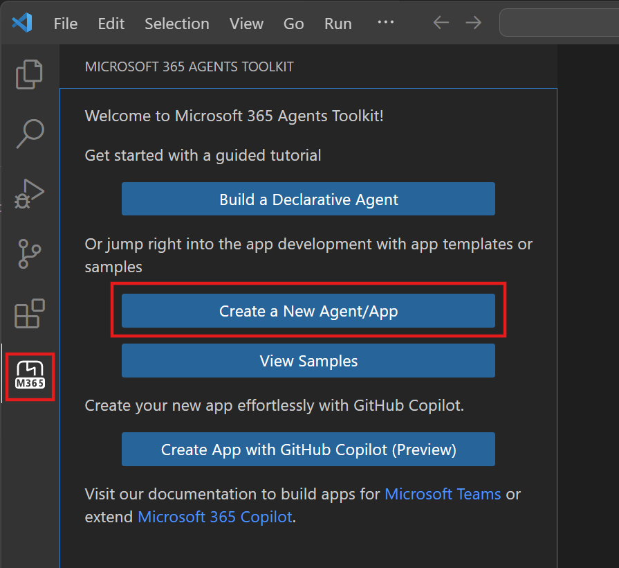
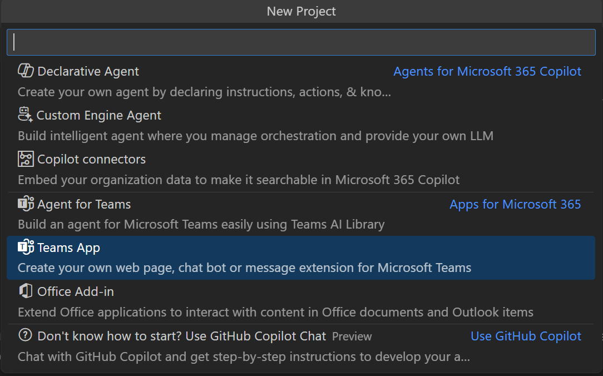
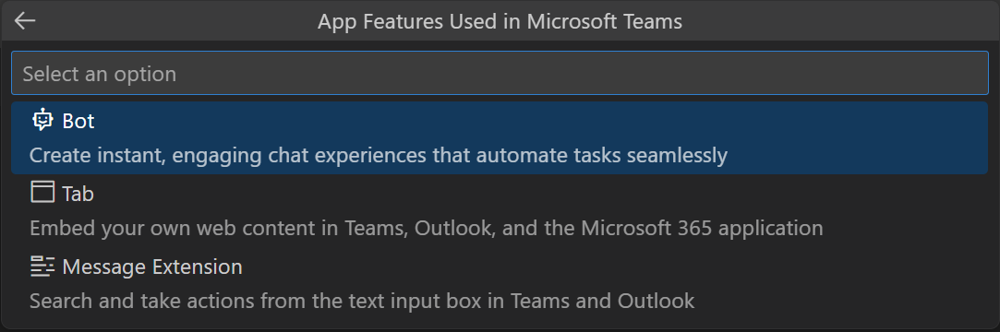
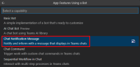
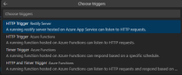
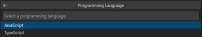
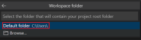
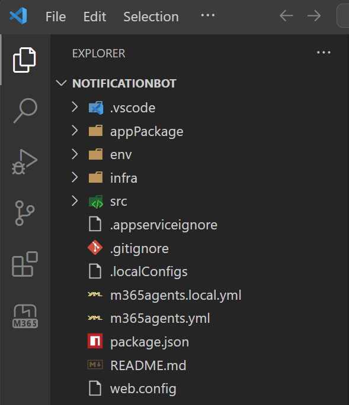

| Step summary        | Where it's located              |
|----------|----------------|
| 1. Click "Create a New Agent/App". |  |
| 2. Select "Teams App". |  |
| 3. Select Bot to create a new bot project. |  |
| 4. Make sure you select Chat Notification Message as the App feature that you want to build in your app. |  |
| 5. Select HTTP Trigger Express Server as the trigger. |  |
| 6. Select JavaScript as the programming language. |  |
| 7. Select Default folder to store your project root folder in default location. |  |
| 8. After your app is created, you will see the app instruction on the left pane. |  |
